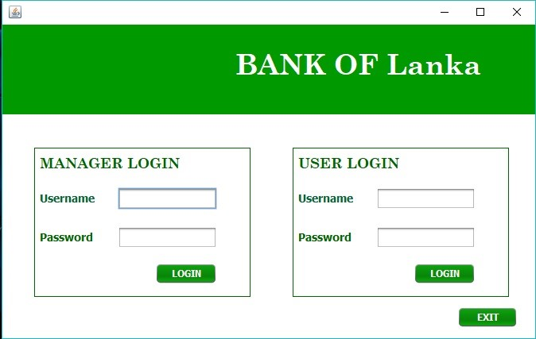
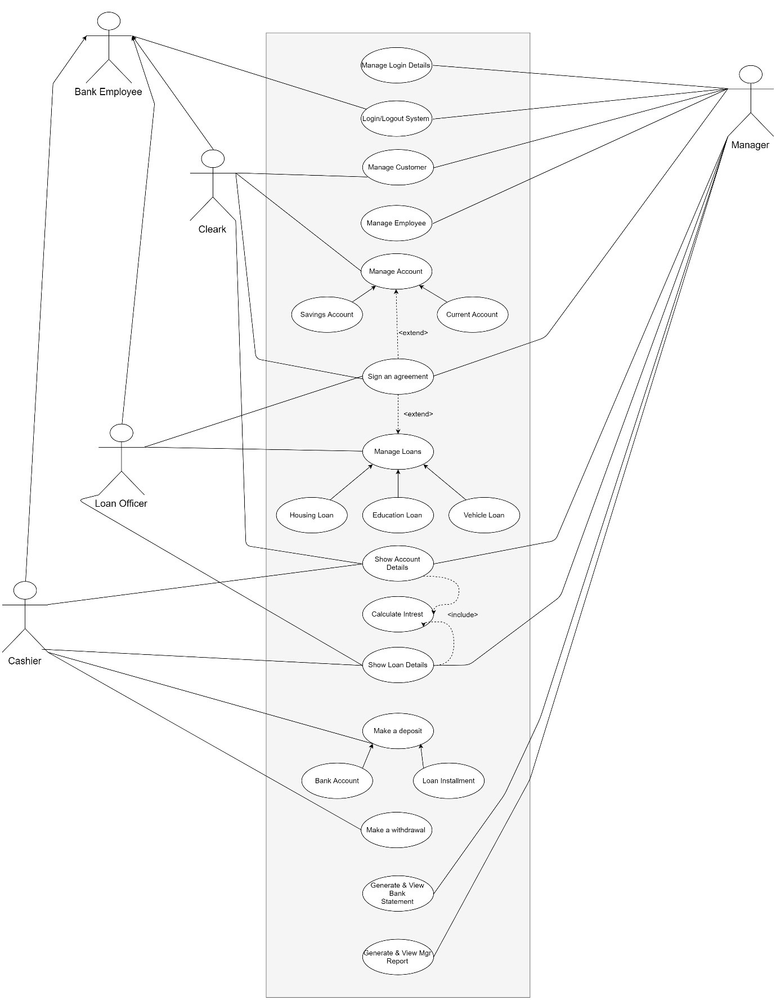
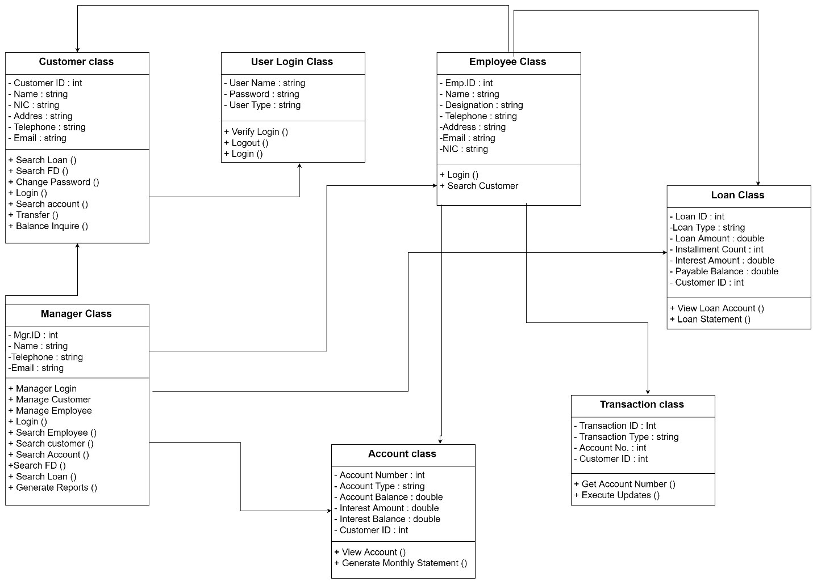
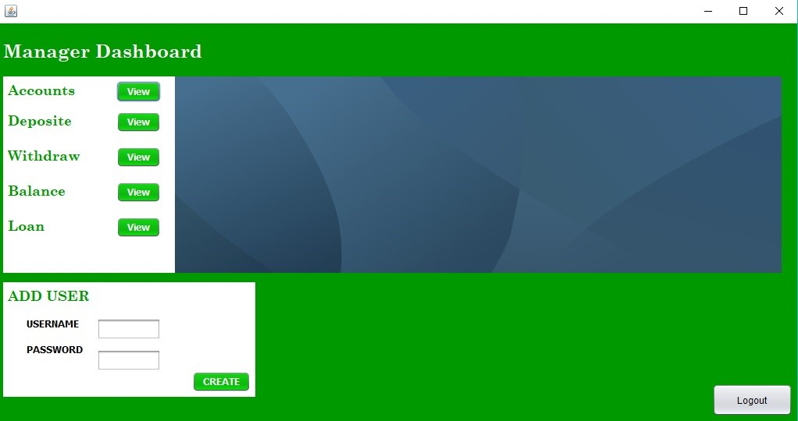
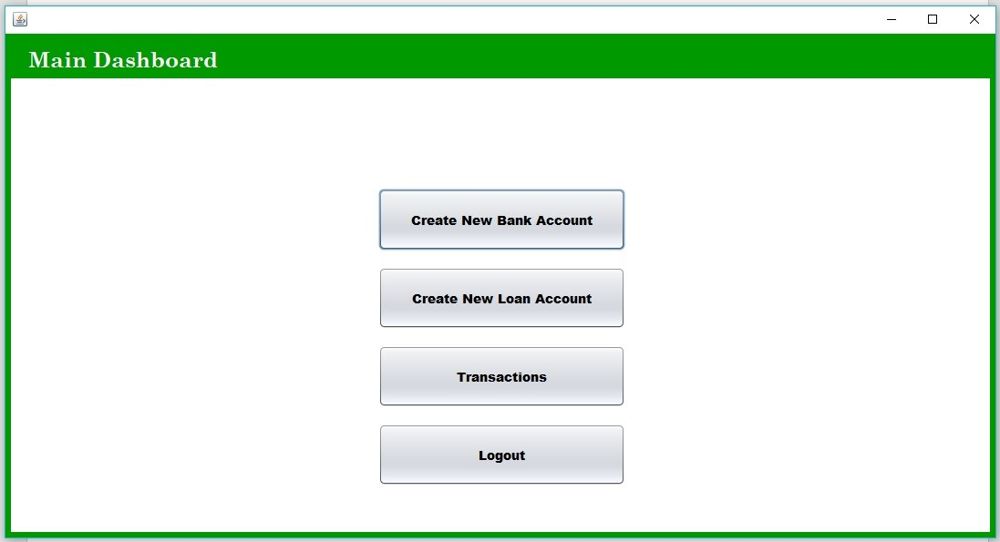
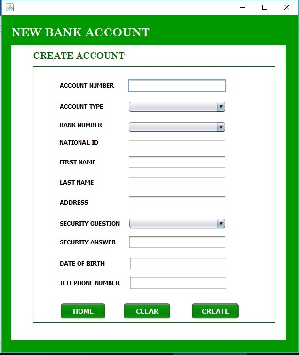
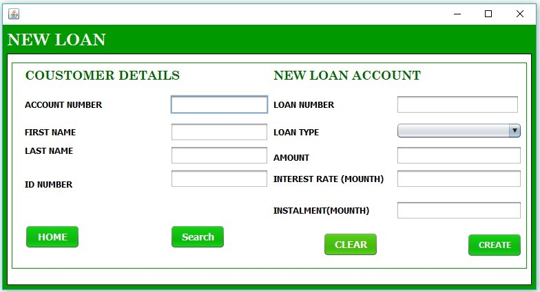
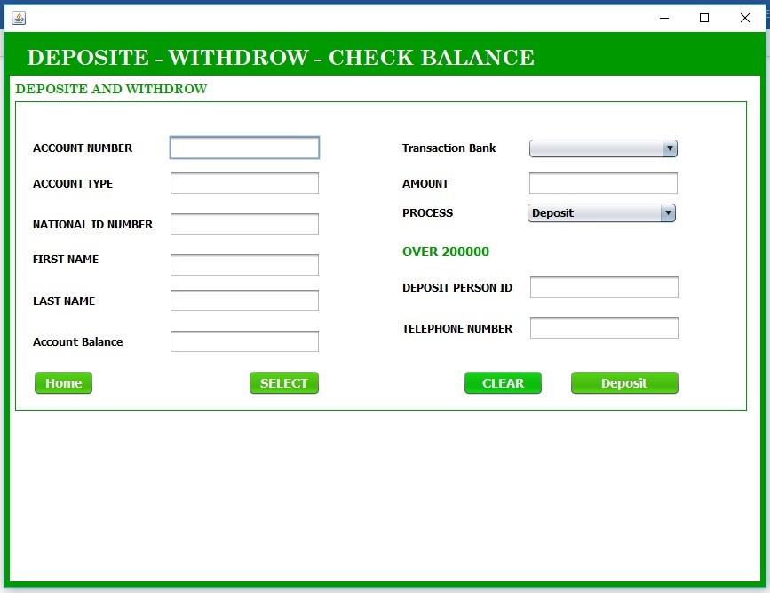

# Bank-Account-and-Loan-Management-System
<h2>The system is designed using object-oriented modeling and object-oriented design.</h2>

<h2>Introduction</h2>
        
Day by day existing technologies is getting developed while new technologies have emerged. In order to work ease, the busy lifestyle people tend to use modern technologies. Once we move on to software applications there are various types of software applications that help people for achieving their needs.
Our case study is about the Bank management system for bank staff and manger. In this project, we have tried to illustrate the procedures of a banking system that cover the basic functionalities including Bank Account creations and Loan  Management.

         
First, we analyze real-world problems in order to make software applications. The Bank Account and loan Management System is an application for maintaining a person's account and loan. also, the Bank and Loan  Management System would be able to maintain information and able to keep records of that particular event. unauthorized access and personal information banks and financial services firms hold can fall into the wrong hands.

           
<h2>Design</h2>

<h3>Bank Account and Loan Management system</h3>

We introduce a Banking system facilitating Account and Loan management facilities, all in one java project for solving financial tasks and carry out the processes easily and quickly. This java application provides better data management and security while monitoring all the activities. This application also will provide convenient customer experience with wider customer services, transparency, and better management of data and information.
 
  

The system is designed using object-oriented modeling and object-oriented design. This project is developed MYSQL JDBC use for the database connection. The content management system deals with java object-oriented Program concepts, java JDBC connectivity, and Exception Handling…etc., all what we covered in the syllabus. 

  
<h3>Technical Specification</h3>
  
<ul>
 <li> We create this project using Java language and with the help of NetBeans IDE.</li>
 <li> We use Java Swing for making graphical user interfaces. </li> 
 <li> We choose XAMPP MySQL as our database. </li>
 <li> We create a Java JDBC connection.</li> 
 <li> We have created this piece of software following all OOP Concepts.</li>
</ul>  

<h3>Account  Management  System Envisage Functionalities </h3>
<ul>
 <li> Customer profile: Name  / address /  Account no / Security Question / Security Answer/ Date of birth / disbursement details etc.</li> 
 <li> Create  Customer new account and store all records in database and  manager can view all  account detail by selected account number.</li> 
 <li> Crate Saving or current accounts.</li> 
 <li> Deposited, withdrew and all records store  in the MYSQL database.</li> 
 <li> The cashier can view all deposited and withdrew balance records by the selected account number.</li>
 <li> Entered text field check with exception handling.</li>
</ul>

<h3>Loan management System Envisage Functionalities  </h3> 
<ul>
 <li> Customer profile: Name /  Loan Account no / Bank Account number  / time / Interest rate  / Instalment.</li>
 <li> Check Exist  Bank account detail in loan applier.</li>
 <li> Create  Customer new  loan account and store all records in database and  manager can view all  account detail by selected loan  account number.</li> 
 <li> Loan installment.  </li>
 <li> Interest Rate.</li>
 <li>The cashier can view all installment and balance records by the selected Loan account number.</li>
 <li> Manage can enter the interest of all accounts.</li>
 <li> Entered text field check with exception handling.</li>
 
</ul>

<h3> User account management </h3> 
<ul>
 <li> Manager can create new username and password.</li> 
 <li> Manger Can View all.</li>  
 <li> Account Details.</li>
 <li> Deposited records.</li>
 <li> Withdrawer records.</li>
 <li> Balance  records.</li>
 <li> Loan account Details.</li>
 </ul>  
   
 <h3> Benefits of the Integrated Application </h3>    
  <ul>
 <li>All banking and loan processing account can handle by one software.</li>
 <li> No need for different staff members for account and loan banking service.</li>
 <li> Manger has the capability of monitoring all the banking activities so that fewer frauds will occur with the system. </li>
 <li> Less processing time making more convenient user experiences.</li>
 <li> Most of the entries are automated therefore less user interaction.</li> 
 <li> Accuracy and the protection of the data are guaranteed by this application.</li>
 <li> Data is stored in the database with fewer redundancies and duplications.</li>
 <li> The time and date of each major process will also be recorded in the system database.</li>
</ul>  

<h3>Use Case Diagram </h3>

        
<h3>class Diagram </h3> 

 
 <h3>Screenshots</h3>
 
 
Login 
         

 
Manager Dashboard
          
  
 
Main Dashboard
          

 
Bank Account Creation Form
          
                
 
Loan Account Creation Form
          
   
 
Transactions Form                                                
          
                                               

